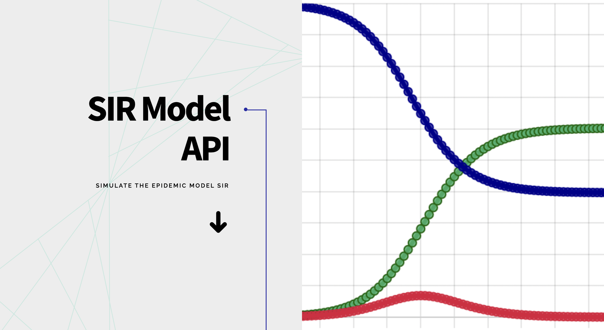

# SIR Model API | Simulate the epidemic model SIR

[SIR Model API](https://sir-epimodel-api.herokuapp.com) is a free API that simulates the [epidemic model SIR](https://en.wikipedia.org/wiki/Compartmental_models_in_epidemiology#The_SIR_model).

Link to project: [https://sir-epimodel-api.herokuapp.com](https://sir-epimodel-api.herokuapp.com).

Postman documentation: [https://documenter.getpostman.com/view/20506585/Uz5NjDZg](https://documenter.getpostman.com/view/20506585/Uz5NjDZg).

# Table of Contents

- [Features](#features)
- [Prerequisites](#prerequisites)
- [Installation](#installation)
- [Usage](#usage)
- [Contribution Guide](#example-applications)
- [Documentation](#documentation)
- [Tech Used](#tech-used)
- [LICENSE](#license)
- [Contact](#contact)
- [My other projects](#my-other-projects)

# Features

- Free to use
- Responds on JSON format

Returns the SIR simulation result given the initial number of susceptible individuals (`s`), the initial number of infected (`i`), the initial number of recovered (`r`), the beta (`b`), the gamma (`g`), and the time length (`t`). All query parameters must be numbers.

Response is an object with four keys: `t` - index of time (index starts at 0), `s` - susceptible individuals at time `t`, `i` - infected individuals at time `t`, and `r` - recovered individuals at time `t`.

# Prerequisites

None. No authentication needed.

# Installation

To run it locally, install dependencies:

```
npm install
```

Run the server:

```
npm run dev
```

Listen to port `9000`. You can use the [sample get request](./requests/get.rest).

# Usage

Sample call:

**Endpoint**:
https://sir-epimodel-api.herokuapp.com/api/sir?s=79000&i=10&r=0&b=0.5&g=0.33&t=10

This asks for the SIR simulation result with 79,000 initial susceptible individuals, 10 initial infected, and 0 initial recovered. The transmission rate is beta = 0.5 while the removal rate is gamma = 0.33. Simulation result is up to t = 10 time points (starts at index 0).

<details>
<summary><b>Response</b></summary>

```json
{
	"t": [0, 1, 2, 3, 4, 5, 6, 7, 8, 9],
	"s": [
		79000, 78995, 78989.15, 78982.31, 78974.31, 78964.95, 78954, 78941.19,
		78926.21, 78908.7
	],
	"i": [10, 11.7, 13.69, 16.01, 18.73, 21.91, 25.63, 29.98, 35.06, 41],
	"r": [0, 3.3, 7.16, 11.68, 16.96, 23.14, 30.37, 38.83, 48.72, 60.29]
}
```

</details>

# Example applications

- [SIR Simulator by ijborda](https://imarijoyborda.com/sir-simulator/)

# Documentation

[Postman documentation](https://documenter.getpostman.com/view/20506585/Uz5NjDZg)

# Tech Used

<p align="center">


</p>
Other sources:

- Welcome page design: <a target="_blank" href="https://html5up.net">HTML5 UP</a>
- Favicon: <a target="_blank" href="https://www.flaticon.com/free-icons/shapes" title="shapes icons">Freepik - Flaticon</a>

# License

[MIT LICENSE](./LICENSE)

# Contact

- [Email](mailto:imari.borda2018@gmail.com)
- [Website](https://imarijoyborda.com/)
- [Github](https://github.com/ijborda)
- [Twitter](https://twitter.com/ijborda)
- [LinkedIn](https://www.linkedin.com/in/ijborda/)

I'm open for contribution. Issue pull request to main.

# My other projects

Check out my other projects:

- [Codie | See your Codewars Stats at a Glance](https://github.com/ijborda/codie)
- [Astrie | See NASA APOD Beautifully](https://github.com/ijborda/astrie)
- [Readability | Readability Test for Researchers](https://github.com/ijborda/readability)
